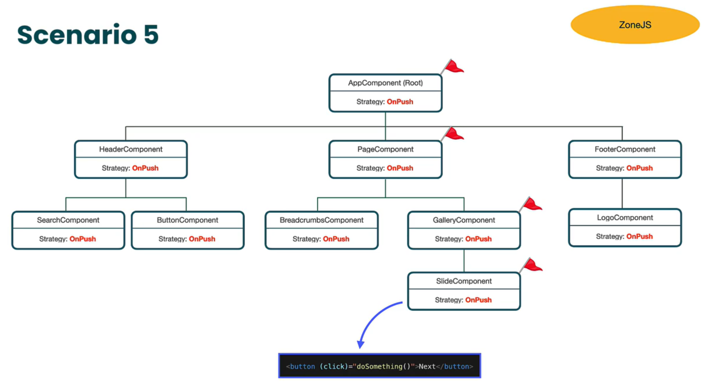

# What is change detection?
A mechanism that tracks changes in the application state and synchronizes those changes with the application view.

In order to connect view and data models we are using such a thing called: binding.
There are different kind of bindings, like:
- string interpolation (`<h2>{{variableName}}</h2>`)
- property binding (`<component [component-variable] = "myvariable"/>`)
- event binding ... etc

## We can split it into two parts
### View Checking
 Synchronization of the component view with the data model.
 (via Changedetector) [simple-component example](./example-for-view-checking-zoneless/src/app/simple-component/simple-component.ts#L30)

### Re-run View checking (1 process)
  Automatically re-execute the View Checking when application state might change.
  That's the point when angular uses Zone.js
  
#### When the app state can be changed?
  1) setTimeout, setInterval, etc is fired
  2) Handling event like click, focus, etc
  3) When HTTP request completes

#### How should angular decide when does it need a view check? -> The Answer was Zone.js earlier

Zone.js uses Monkey patching to patch the browser's native api, which means bring some interceptors and hooks to it. (changes code sneakily at runtime without any rules) (Similar to AOP and Decorator pattern.)

```javascript
const originalConsoleLog = console.log;

console.log = function(...args){
  originalConsoleLog(...args);
  console.warn('This method was monkey-patched & will trigger change detection!');
  const appRootComp = ng.getComponent(document.querySelector('app-simple-component'));
  //appRootComp.cdr.detectChanges();
} 
```

In the background it calls appref.tick() method which function calls all the view.detectChanges() function.
Zone.js does not trigger the views for every little action (like scrolling or clicking).
To run change detection two conditions has to be fulfilled:
1) the event has to happen within angular zone eventlistener needs to be registered in you angular application
2) events needs to have a handler

#### How angular uses zone.js on code level:
   1) as a dependency in package-json
   2) import in polyfills in angular json
   3) import in main.ts or in polyfills.ts
   4) in main.ts or in appconfig: provideZoneChangeDetection()

#### Is there any alternative for Zone.js?
##### OnPush strategy
We can add to our components an extra property: `ChangeDetectionStrategy: ChangeDetectionStrategy.OnPush`
In this case components have to "raise a flag" that they need a view cheking, so they won't be "reloaded" by zone automatically only if we call `this.cdr.markForCheck()`.

```Typescript
@Component({
  selector: 'app-simple-component',
  imports: [ChildComponent],
  //All bindings interested in data changing
  template: `
    <h2>{{ topicName }}</h2>
    @if (isVisible) {
      <div>{{ getInfo() }}</div>
    }
    <app-child-component />
  `,
  styleUrl: './simple-component.scss',
  ChangeDetectionStrategy: ChangeDetectionStrategy.OnPush
})
export class SimpleComponent {
  topicName = 'Decoded frontend';
  isVisible = true;

  getInfo() {
    console.log('getInfo function has been called');
    return 'random info';
  }

  constructor(private cdr: ChangeDetectorRef) {
    setTimeout(() => {
      this.topicName = 'new topic name after timeout';
      console.log('Topic name changed to', this.topicName);
      cdr.markForCheck(); // itt will be scheduled to the next change detection cycle
      //only this component and all it's anchestors (parents)
    }, 3000);
  }
}

```
In this case we have to take care of change detection manually. (not in every case dive deeper here: [
Change Detection in Angular Pt.3 - OnPush Change Detection Strategy](https://www.youtube.com/watch?v=WAu7omIoerM)




### What does it mean zoneless?
Change detection is a bottleneck of large applications.
It does not know properly which component has to be refreshed.
It requires an extra bundle size also.

#### Introducing signals


